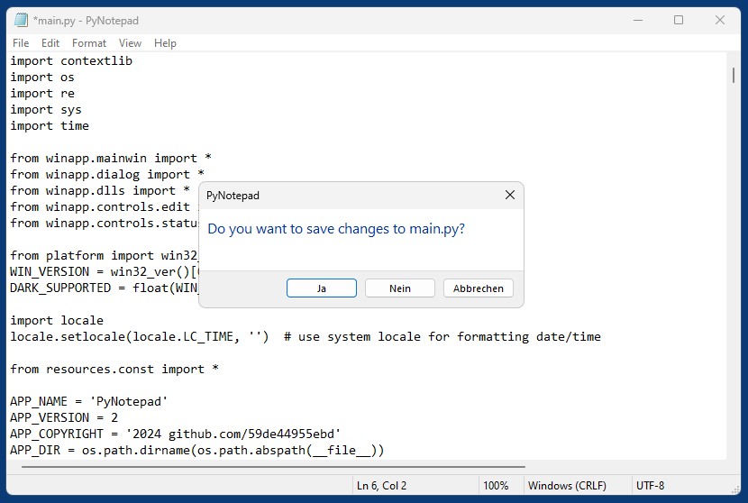
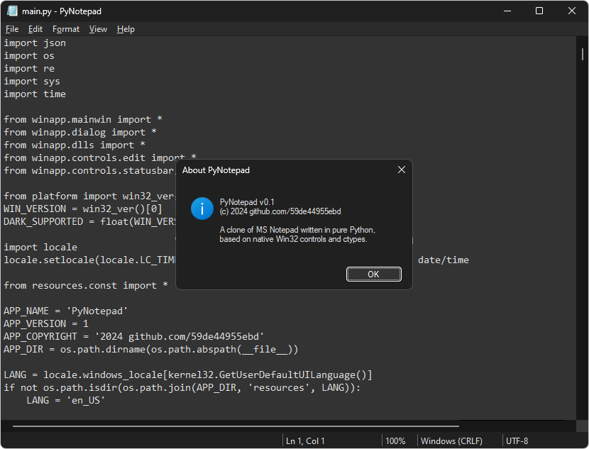

# PyNotepad
A clone of Windows Notepad written in pure Python (no third-party modules), based on native Win32 controls and ctypes (Petzold style).

## Differences to original Notepad

* No "Search with Bing" (pointless)
* No online help (pointless)
* No "Page Setup" dialog (rather pointless, page format can be selected in printer dialog)
* Encoding is not selected in the "Save As" dialog, but instead in the File menu before saving
* Localized only for english and german (more languages can be added by duplicating and editing .json files in the resources folder)
* PyNotepad supports dark mode.

## Screenshots

*PyNotepad in Windows 11*  

*PyNotepad in Windows 11 (Dark Mode)*  

