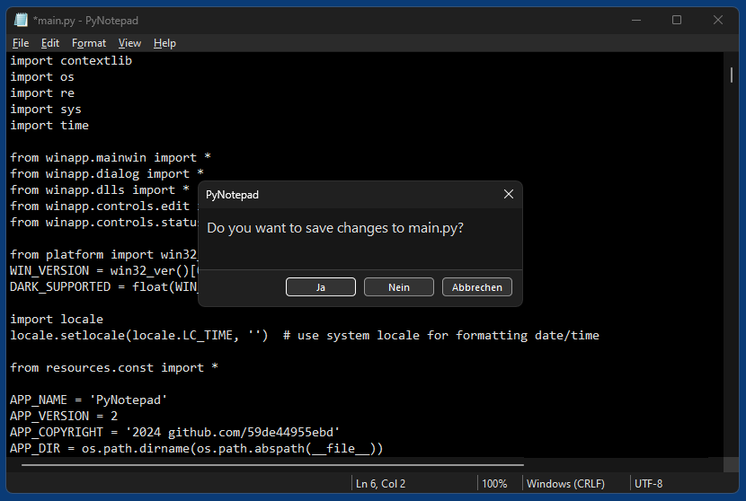

# PyNotepad
A clone of Windows Notepad written in pure Python (no third-party modules), based on native Windows controls and ctypes/libffi

## Differences to original Notepad
- Better indentation:
  - Can indent/unindent multiline selection via Tab/Shift+Tab
  - Supports using spaces instead of tabs
  - Allows to adjust the tab width/indendation width (2, 4 or 8 spaces)
  - If using spaces for indentation, Backspace deletes leading indentation according to selected indentation width
- No "Search with Bing" (pointless)
- No online help (pointless)
- Encoding is not selected in the "Save As" dialog, but instead in the File menu before saving
- Localized only for english and german (more languages can be added by duplicating and editing config files in the resources folder)
- PyNotepad supports dark mode.

## Screenshots

*PyNotepad in Windows 11*  

*PyNotepad in Windows 11 (Dark Mode)*  

